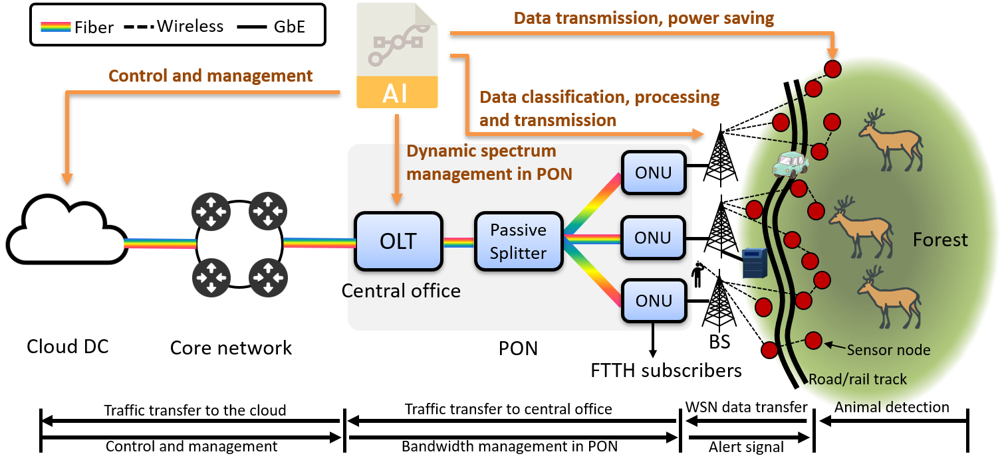

# Animal-Human-Cohabitation

This repository contains source codes for building an early warning system which detects wild animals near the road/rail with the help of wireless sensor networks and alerts passing vehicles of possible animal crossing.
We show that animals’ detection at the earliest and the related processing, if possible, at sensors would reduce the energy consumption of edge devices and the end-to-end delay in notifying vehicles, as compared to the scenarios where raw sensed data needs to be transferred up the base stations or the cloud. At the same time, machine learning helps in classification of captured images at edge devices, and in predicting different time-varying traffic profiles— distinguished by latency and bandwidth requirements—at base stations, including animal appearance events at sensors, and allocating bandwidth in FiWi access networks accordingly. We compare three scenarios of processing data at sensor nodes, base stations and a hybrid case of processing sensed data at either sensors or at base stations, and showed that dynamic allocation of bandwidth in FiWi access networks and processing data at its origin lead to lowering the congestion of network traffic at base stations and reducing the average end-to-end delay.

For more details, see https://www.mdpi.com/2224-2708/7/3/35
